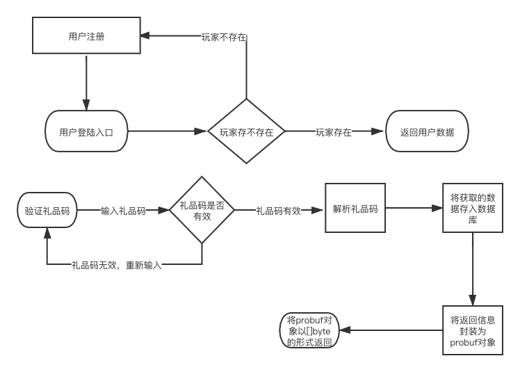

## 1.整体框架

整体功能的实现思路	

设计登录和注册接口，登录时返回用户信息，注册时返回用户uid

设计领取礼品接口，当输入礼品码和用户uid时，将信息以protobuf对象的形式通过gin返回客户端，并且将信息存入mongodb中

## 2.目录结构

```
.
├── README.md
├── __pycache__
│   └── locustfile.cpython-39.pyc
├── app
│   ├── app
│   ├── http
│   │   └── httpserver.go
│   └── main.go
├── day4压力测试.html
├── day4流程图.png
├── globalError.go
├── go.mod
├── go.sum
├── internal
│   ├── ctrl
│   │   └── api.go
│   ├── gError.go
│   ├── handler
│   │   ├── userInfo.go
│   │   └── userInfo_test.go
│   ├── router
│   │   └── router.go
│   ├── service
│   │   └── dealData.go
│   └── util
│       └── util.go
├── locustfile.py
└── model
    ├── database.go
    ├── mongo.go
    ├── test.pb.go
    └── test.proto

```

## 3.逻辑代码分层

|    层     | 文件夹                                     | 主要职责                                        | 调用关系                  | 其它说明     |
| :-------: | ------------------------------------------ | ----------------------------------------------- | ------------------------- | ------------ |
|  应用层   | /app/http/httpServer.go                    | 服务器启动                                      | 调用路由层                | 不可同层调用 |
|  路由层   | /internal/router/router.go                 | 路由转发                                        | 被应用层调用，调用控制层  | 不可同层调用 |
|  控制层   | /internal/ctrl/api.go                      | 请求参数处理，响应                              | 被路由层调用，调用handler | 不可同层调用 |
| handler层 | /internal/handler/userInfo.go              | 处理具体业务                                    | 被控制层调用              | 不可同层调用 |
|  model层  | /app/model/database.go,/app/model/mongo.go | redis储存需要的数据结构,mongo储存需要的数据结构 | 被handler调用             | 不可同层调用 |
| 压力测试  | locustfile.py                              | 进行压力测试                                    | 无调用关系                | 不可同层调用 |
|  gError   | /internal/gError                           | 统一异常处理                                    | 被handler调用             | 不可同层调用 |
| service层 | /internal/service/dealDate.go              | 操作redis数据库和mongo数据库                    | 被handler层调用           | 不可同层调用 |

## 4.存储设计

mongo数据库通过struct的形式储存，分别为uid，金币数和钻石数

protobuf使用文件给的格式

## 5.接口设计

请求方法：

http post

| 接口地址                    | 请求参数      | 描述         |
| --------------------------- | ------------- | ------------ |
| localhost:8080/login        | key           | 登录         |
| localhost:8080/register     |               | 注册         |
| localhost:8080/receiveGifts | key，username | 用户领取礼品 |

响应状态码

| 状态码 | 描述                   |
| ------ | ---------------------- |
| 1001   | 礼品码不存在           |
| 1002   | 礼品码过期             |
| 1003   | 不可重复领取           |
| 1004   | 礼品全部领完           |
| 1005   | 参数不能为空           |
| 1006   | 有效期不能小于当前时间 |
| 1007   | 礼品码不合法           |

## 6.第三方库

```
  "github.com/gin-gonic/gin"
	"net/http"
	"encoding/json"
	"fmt"
	"github.com/golang/protobuf/proto"
	"gopkg.in/mgo.v2"
	"gopkg.in/mgo.v2/bson"
	"strconv"
	"time"
	"encoding/json"
	"testing"
	"github.com/garyburd/redigo/redis"
```

## 7.编译运行

cd app

go build

./app

运行

cd internal

cd handler

go test

单元测试

locust

压力测试

